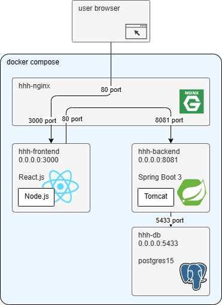
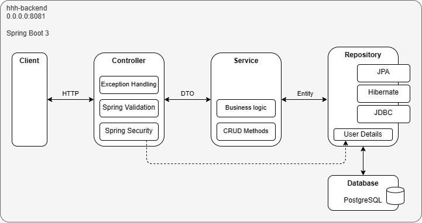
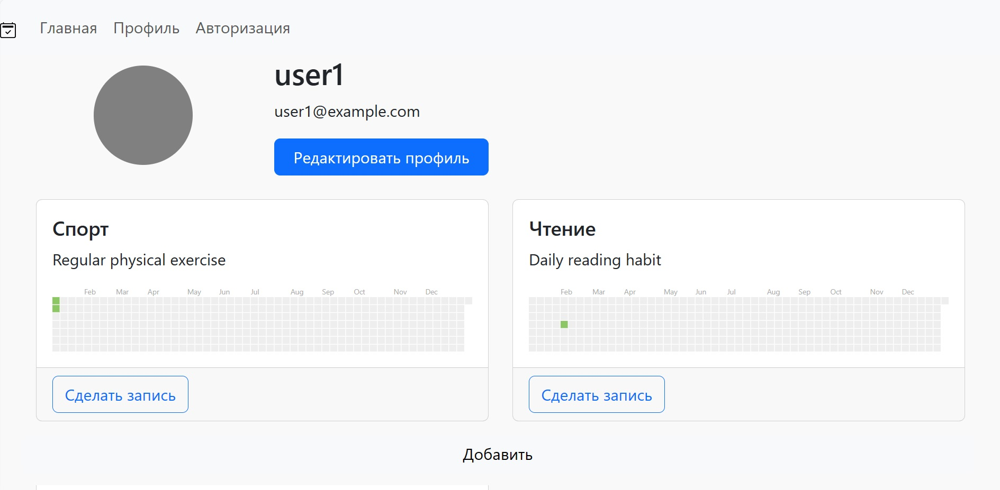
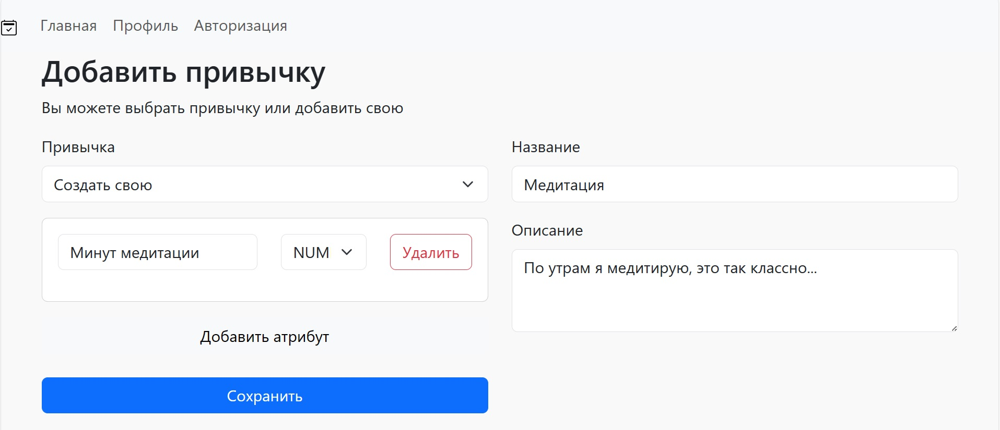
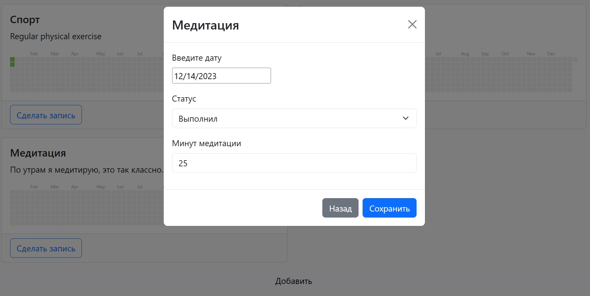

# hhh
Приложение - трекер привычек

### Основные функции:
- Выбор шаблона привычек
- Создание своих привычек
- Добавление атрибутов привычкам (количество отжиманий, прочитано страниц...)
- Выбор вида атрибута привычки: текст, число, чекбокс
- Добавление записей по привчкам
- Заполнение полей в атрибутах в записи (например, сколько отжиманий сделано или сколько страниц прочитано)
- Отслеживание прогресса

### Инструкция по запуску
git clone ...
docker-compose up --build

Профиль пользователя - http://localhost/profile/1
Описание API - http://localhost:8081/swagger-ui/index.html#

### Структура проекта
* hhh-backend - **Серверное приложение (Spring boot 3)**
* hhh-frontend - **Клиентское приложение (React.js)**
* docker - Дополнительные настройки контейнеров Docker

### Технологии
* **Framework**: Spring Boot 3 *(Security 6, Data JPA, Validation)*
* **Build**: Maven
* **ORM**: Hibernate
* **DB**: postgres
* **Containers**: Docker, Docker-compose
* **Swagger**: springdoc openapi v3
* **Front**: React.js, react-bootstrap, react-router-dom v6, react-calendar-heatmap
* **Proxy**: Nginx
* **Other**: Lombok

### Архитектура

*Архитектура*

*Бэкенд*

### Изображения

*Профиль пользователя*

*Добавить привычку*

*Добавить запись по привычке*